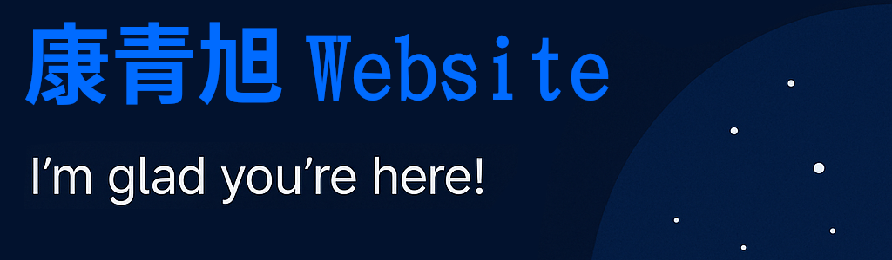

# 康青旭 — Personal Website

This site serves as a personal portfolio and my public second brain. You'll see:

- ✍️ **Posts** – Articles, writeups, and academic notes (currently in English).
- 🛠️ **Projects** – Real projects, research and personal work in AI, ML, Systems, Languages, and Cognition.
- 🧪 **Weekly Log** – Raw, unedited personal journals, published through Notesnook monographs.
- 🧵 **Drafts** – Early ideas and or unfinished content, also extra notes for projects.

For now, most content will be published in English with links to my **original source material in Spanish or Chinese** (or whichever language I wrote it in that moment).  
Multilingual support will be added soon via an LLM-powered translation layer powered by a custom Nim tool.

The content is organized following the PARA method (Projects, Areas, Resources, Archives) beign my effort to build a meaningful and multilingual knowledge base.

---

## Built With

- 🌙 [Moonrise Jekyll Theme](https://github.com/TolgaTatli/Moonrise)  
  Licensed under the [MIT License](https://github.com/GCaggianese/GCaggianese.github.io/blob/master/LICENSE).  
  Created by [@TolgaTatli](https://github.com/TolgaTatli) — full credit for the theme.

- 🧠 Powered by GitHub Pages, Jekyll, written in Notesnook.

---

## License

All theme-related assets follow the original MIT license from Moonrise.  
All personal content on this website belongs to me, 康青旭, unless otherwise noted.
